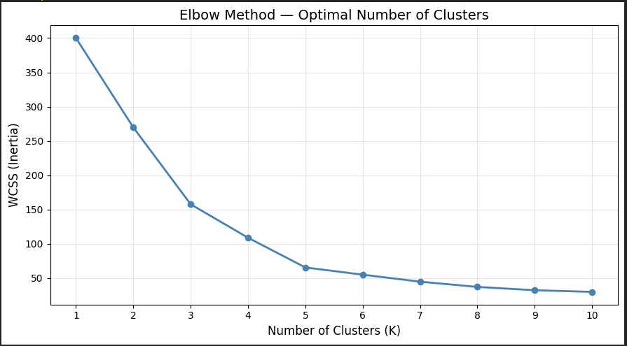
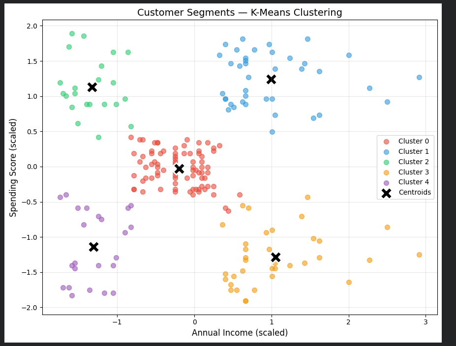
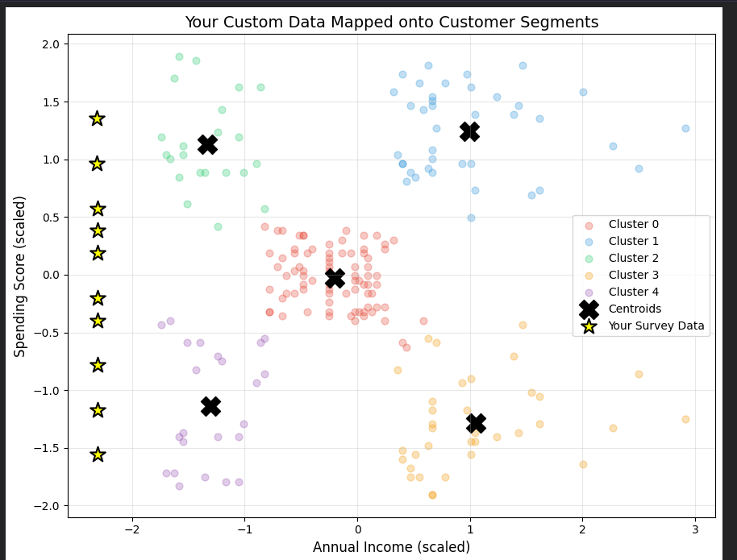

# K-Means Customer Segmentation

## Project Overview
This project clusters mall customers into 5 segments based on
Annual Income and Spending Score using K-Means clustering. The
trained model is then used to assign 10 real-world survey
responses to their corresponding customer segments.

## Folder Structure
- `dataset/Mall_Customers.csv` — standard training dataset
- `dataset/custom_data.csv` — my 10 real-world survey responses
- `model/220124.pkl` — trained K-Means model + fitted scaler (combined)
- `220124.ipynb` — full Colab notebook (data loading, training, prediction)

## How the Model Was Built
1. Loaded `Mall_Customers.csv` and selected `Annual Income (k$)` and `Spending Score (1-100)` as features
2. Scaled the features using `StandardScaler`
3. Used the Elbow Method to determine the optimal number of clusters (K=5)
4. Trained a K-Means model with K=5
5. Saved the model and scaler together in `model/220124.pkl`
6. Loaded `custom_data.csv`, applied the same fitted scaler, and predicted cluster assignments

## Elbow Curve

The elbow curve shows WCSS dropping sharply until K=5, after which
the improvement flattens — confirming K=5 as the optimal number of clusters.

## Cluster Visualization

Each color represents a distinct customer segment. Black "X" markers
show the centroid (center point) of each cluster.

## Custom Data Predictions

The yellow stars show where my 10 surveyed individuals fall relative
to the existing customer segments.

## Cluster Interpretation
- **Cluster 0**: [Describe based on YOUR results, e.g., "Older, high-income, low spenders — cautious savers"]
- **Cluster 1**: [Describe, e.g., "Young, high-income, high spenders — premium target customers"]
- **Cluster 2**: [Describe, e.g., "Low-income, low spenders — budget-conscious shoppers"]
- **Cluster 3**: [Describe, e.g., "Middle-income, average spenders — typical customers"]
- **Cluster 4**: [Describe, e.g., "Low-income, high spenders — impulsive buyers"]

## Custom Data Results
My 10 survey respondents were distributed across clusters as follows:
- Cluster 0: [X] people
- Cluster 1: [X] people
- Cluster 2: [X] people
- Cluster 3: [X] people
- Cluster 4: [X] people

## How to Run
1. Open `220124.ipynb` in Google Colab
2. Click **Runtime → Run all**
3. The notebook automatically clones this repo and runs the full pipeline — no manual file uploads needed